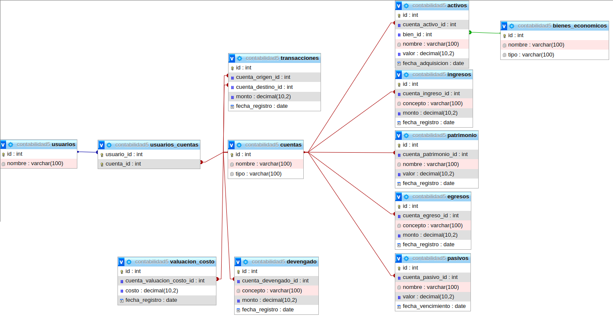

# HAE de Contabilidad Empresarial


<center >


</
center >


La HAE de Contabilidad Empresarial es una aplicación administrativa diseñada para ayudar a las empresas a gestionar sus registros contables, seguimiento de transacciones y generar informes financieros. Esta API proporciona funcionalidades para crear y administrar cuentas contables, registrar transacciones y generar balances.

## Objetivo

El objetivo principal de este proyecto es ofrecer a las empresas una herramienta eficiente y fácil de usar para llevar el control contable de sus operaciones. Al utilizar esta "herramienta", los usuarios podrán realizar tareas como:

- Crear y gestionar cuentas contables.
- Registrar transacciones financieras, especificando las cuentas involucradas y los montos correspondientes.
- Generar informes y balances para evaluar la salud financiera de la empresa.

## Estado del Proyecto

Actualmente, el proyecto se encuentra en desarrollo

## Características

El proyecto de Express incluye las siguientes características:

- Crear y gestionar cuentas contables.
- Registrar transacciones financieras, especificando las cuentas involucradas y los montos correspondientes.
- Generar informes y balances para evaluar la salud financiera de la empresa.

## Próximos 6 días

Durante los próximos 6 días, se trabajarán en las siguientes tareas para mejorar y expandir la funcionalidad de la API:

1. **Día 1**: Implementar endpoints para crear, actualizar y eliminar cuentas contables.
2. **Día 2**: Desarrollar funcionalidades para registrar transacciones financieras y asociarlas con las cuentas correspondientes.
3. **Día 3**: Implementar un endpoint para generar el balance general de la empresa en una fecha específica.
4. **Día 4**: Añadir validaciones y manejo de errores a los endpoints existentes para garantizar la integridad de los datos.
5. **Día 5**: Mejorar la seguridad de la API mediante la implementación de autenticación y autorización.
6. **Día 6**: Realizar pruebas exhaustivas y corregir posibles errores o mejoras sugeridas.
7. **Día 7**: Implementar funcionalidades para generar informes detallados de transacciones por categoría y período de tiempo.

   - Tarea 1: Agregar nuevos endpoints que permitan filtrar transacciones por categoría y período de tiempo especificado.
   - Tarea 2: Desarrollar consultas SQL para obtener la información necesaria para generar los informes solicitados.

8. **Día 8**: Optimizar el rendimiento de la API y realizar ajustes para mejorar la escalabilidad del sistema.

   - Tarea 1: Revisar el código y buscar posibles puntos de optimización, como consultas SQL redundantes o ineficientes.

9. **Día 9**: Agregar funcionalidad para registrar nuevos bienes económicos en la base de datos.

   - Tarea 1: Crear endpoints que permitan la creación, actualización y eliminación de bienes económicos.
   - Tarea 2: Desarrollar consultas SQL para insertar, actualizar y eliminar registros en la tabla de "bienes_economicos".

Ten en cuenta que estos objetivos son flexibles y podrían estar sujetos a cambios o ajustes según las necesidades del proyecto.

## Estructura de DB



## Documentacion para (casi) no desarrolladores

**Nota**:Existe una guia mucho más simple y explicita sobre como hacer uso de este proyecto,y donde especifico unas configuraciones importantes te dejo el link aca abajito (recomiendo que lo leas)

Dar click en la imagen...

<a href="https://github.com/miusarname/apifiltro/blob/main/docs/guideToUse.md">  </a>

## Requisitos previos

Para instalar y ejecutar el proyecto, se requieren los siguientes componentes:

- Node.js
- NPM

## Tecnologías Utilizadas

El proyecto hace uso de las siguientes tecnologías:

- Node.js
- Express
- MySQL
- JWT (JSON Web Tokens)

## Instalación

Para instalar el proyecto, sigue estos pasos:

1. Clona el repositorio:

```bash
git clone https://github.com/miusarname/apifiltro.git
```

2. Dirígete al directorio del proyecto:

```bash
cd apifiltro
```

3. Instala las dependencias:

```bash
npm install
```

4. Crea el archivo .env con la configuración de la base de datos y el puerto:

````bash
PORT=3000 o <puerto_donde_correra_tu_servidor>(Este puerto debe estar disponible, si te sale algo como esto :

```bash
node:events:492
      throw er; // Unhandled 'error' event
      ^

Error: listen EADDRINUSE: address already in use :::3005
    at Server.setupListenHandle [as _listen2] (node:net:1872:16)
    at listenInCluster (node:net:1920:12)
    at Server.listen (node:net:2008:7)
    at Function.listen (/home/apolt01-013/Desktop/carpetica/apifiltro/node_modules/express/lib/application.js:635:24)
    at file:///home/apolt01-013/Desktop/carpetica/apifiltro/controller/index.js:21:5
    at ModuleJob.run (node:internal/modules/esm/module_job:192:25)
    at async DefaultModuleLoader.import (node:internal/modules/esm/loader:228:24)
    at async loadESM (node:internal/process/esm_loader:40:7)
    at async handleMainPromise (node:internal/modules/run_main:66:12)
Emitted 'error' event on Server instance at:
    at emitErrorNT (node:net:1899:8)
    at process.processTicksAndRejections (node:internal/process/task_queues:82:21) {
  code: 'EADDRINUSE',
  errno: -98,
  syscall: 'listen',
  address: '::',
  port: 3005
}

Node.js v20.5.0
```
Significa que el puerto esta ocupado y debes poner otro


DB_NAME="nombre_de_tu_base_de_datos"
DB_USER="tu_usuario_de_mysql"
DB_PASSWORD="contraseña_de_tu_base_de_datos"
DB_HOST="localhost"
DB_PORT=3306 o <puerto_de_tu_base_de_datos> (por ejemplo: 3306)
JWT_PRIVATE_KEY = <La_key_con_la_cual_desencripta_el_JWT> (Este campo es libre, lo quiera poner)
````

Reemplaza los valores entre comillas con los correspondientes a tu base de datos MySQL.

En mi caso quedo algo así :

```bash
PORT = 3005
DB_NAME="contabilidad5"
DB_USER="campus"
DB_PASSWORD="campus2023"
DB_HOST="localhost"
DB_PORT=3306
JWT_PRIVATE_KEY = "OscarElPapu"
```

## Ejecución

Para ejecutar la aplicación, simplemente ejecuta el siguiente comando:

**Nota** :Primero en otra consola o terminal en la ruta de la aplicación deberas ejecutar esto :

```bash
npm run tsc
```
luego esto :

```bash
npm run dev
```

La aplicación se ejecutará en el puerto especificado en el archivo .env, por ejemplo, en este caso en el puerto 3000. Puedes acceder a ella en la siguiente URL:

http://localhost:3000/

## El proyecto incluye las siguientes consultas:

### - Consulta 1: Obtiene todos las cuentas. Endpoint: /cuenta (GET)

#### Explicacion de como enviar

Voy a explicar el json con el siguiente "diagrama":

```json

{
    "key":<tipo_de_dato>,
}

```

Los datos a enviar son

```json
{
    "nombre":String,
    "tipo":Number,
    "id":Number
}
```

### - Consulta 2: Crea una nueva cuenta. Endpoint: /cuenta (POST)

#### Explicacion de como enviar

Voy a explicar el json con el siguiente "diagrama":

```json

{
    "key":<tipo_de_dato>,
    "key":? <Esto_significa_que_es_opcional>
}

```

Los datos a enviar son

```json
{
    "nombre":String,
    "tipo":Number,
    "id":? Number
}
```

### - Consulta 3: Actualiza una cuenta con los valores. Endpoint: /cuenta (PUT)

#### Explicacion de como enviar

Voy a explicar el json con el siguiente "diagrama":

```json

{
    "key":<tipo_de_dato>,
}

```

Los datos a enviar son

```json
{
    "nombre":String,
    "tipo":Number,
    "id":Number
}
```

### - Consulta 4: Elimina una cuenta teniendo en cuenta el id. Endpoint: /cuenta (DELETE)

#### Explicacion de como enviar

Voy a explicar el json con el siguiente "diagrama":

```json

{
    "key":<tipo_de_dato>,
}

```

Los datos a enviar son

```json
{
    "nombre":? String,
    "tipo":? Number,
    "id":Number
}
```

### - Consulta 5: Crea una nueva transacción. Endpoint: /transaccion (POST)

#### Explicacion de como enviar

Voy a explicar el json con el siguiente "diagrama":

```json

{
    "key":<tipo_de_dato>,
}

```

Los datos a enviar son

```json
{
    "id":Number,
    "fecha_registro":String(De este tipo de formato " 2023-07-25 "),
    "monto":Number,
    "cuenta_destino_id":Number,
    "cuenta_origen_id":Number
}
```

### - Consulta 6: Crea un balance a partir de datos de la base de datos. Endpoint: /balance (GET)

#### Explicacion de como enviar

Voy a explicar el json con el siguiente "diagrama":

```json

{
    "key":<tipo_de_dato>,
}

```

Los datos a enviar son

```json
{
    "id":Number
}
```

### - Consulta 7: Permite filtrar transacciones por categoría y por período de tiempo especificado. Endpoint: /transacciones/timeortype (GET)

#### Explicacion de como enviar

En este caso vale la pena mencionar que está hecho de forma que se envia por el query es decir por aca:

```bash
/transacciones?Info=a
```

En este caso se haria con la siguiente estructura :

```bash
/transacciones/timeortype?categoria=<categoria>&fechaInicio=<fecha_de_inicio>&fechaFin=<fecha_de_fin>
```

### - Consulta 8: Crea un nuevo bien Economico. Endpoint: /activos/bienesE (POST)

#### Explicación de cómo enviar

Para crear una nueva transacción, debes enviar una solicitud HTTP POST al endpoint /transaccion con un JSON en el cuerpo de la solicitud que siga la siguiente estructura:

```json
{
    "nombre": "<nombre_del_bien>",
    "tipo": <tipo_de_dato>
}
```

Donde:

- `nombre`: Es el nombre del bien Economico. Por ejemplo, "Propiedad de 1500M".

- `tipo`: Representa el tipo de bien. Debe ser un string que describa el tipo.

Asegúrate de reemplazar `<tipo_de_dato>` y `<nombre_del_bien>` con los tipos de datos adecuados para cada campo. Por ejemplo, `<tipo_de_dato>` puede ser `string` y `<nombre_del_bien>`.

### - Consulta 9: Modificar un bien Economico. Endpoint: /activos/bienesE/:id (PUT)

#### Explicación de cómo enviar

Para crear una nueva transacción, debes enviar una solicitud HTTP POST al endpoint /transaccion con un JSON en el cuerpo de la solicitud que siga la siguiente estructura:

```json
{
    "nombre": "<nombre_del_bien>",
    "tipo": <tipo_de_dato>
}
```

Donde:

- `id`: Representa el identificador único del bien. Si este campo se incluye en la solicitud, debe ser un número.

- `nombre`: Es el nombre del bien Economico. Por ejemplo, "Propiedad de 1500M".

- `tipo`: Representa el tipo de bien. Debe ser un string que describa el tipo.

Asegúrate de reemplazar `<tipo_de_dato>` y `<nombre_del_bien>` con los tipos de datos adecuados para cada campo. Por ejemplo, `<tipo_de_dato>` puede ser `string` y `<nombre_del_bien>`.

### - Consulta 10: Elimina un bien Economico. Endpoint: /activos/bienesE/:id (DELETE)

#### Explicación de cómo enviar

Para crear una nueva transacción, debes enviar una solicitud HTTP POST al endpoint /transaccion con un JSON en el cuerpo de la solicitud que siga la siguiente estructura:

```json
{
    "nombre": "<nombre_del_bien>",
    "tipo": <tipo_de_dato>
}
```

Donde:

- `id`: Representa el identificador único del bien. Si este campo se incluye en la solicitud, debe ser un número.

- `nombre`: Es el nombre del bien Economico. Por ejemplo, "Propiedad de 1500M".

- `tipo`: Representa el tipo de bien. Debe ser un string que describa el tipo.

Asegúrate de reemplazar `<tipo_de_dato>` y `<nombre_del_bien>` con los tipos de datos adecuados para cada campo. Por ejemplo, `<tipo_de_dato>` puede ser `string` y `<nombre_del_bien>`.

## Contribuciones

¡Se agradecen las contribuciones! Si deseas contribuir al proyecto, puedes enviar una solicitud de extracción a través de GitHub.

## Licencia

El proyecto está bajo la licencia MIT.
